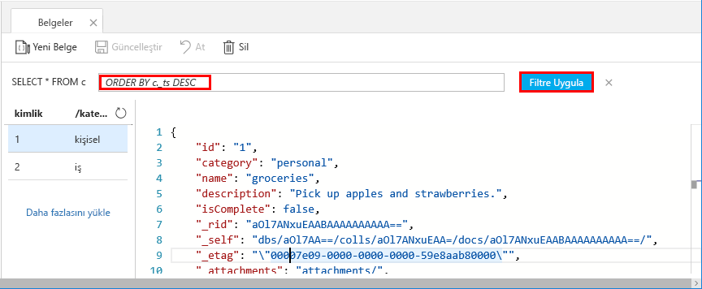

Almak ve verilerinizi filtrelemek için veri Gezgini'ndeki sorguları kullanabilirsiniz.

1. Üst kısmındaki **belgeleri** sekmesinde veri Gezgini'nde, varsayılan sorguyu inceleyin `SELECT * FROM c`. Bu sorguyu alır ve kimliği sırayla koleksiyondaki tüm belgeleri görüntüler. 
   
   
   
1. Sorguyu değiştirmek için seçin **filtreyi Düzenle**, varsayılan sorguyla değiştirin `ORDER BY c._ts DESC`ve ardından **Filtre Uygula**.
   
   

   Şimdi ikinci belgeniz, zaman damgası göre azalan sırayla düzenleyin belgeleri ilk listelenen değiştirilmiş sorguyu görüntüler. 
   
   

Tanıdık SQL söz dizimi, desteklenen herhangi biri girebilirsiniz [SQL sorguları](../articles/cosmos-db/sql-api-sql-query.md) sorgu koşulu kutusuna içinde. Veri Gezgini, saklı yordamlar, UDF'ler ve Tetikleyiciler için sunucu tarafı iş mantığı oluşturma için de kullanabilirsiniz. 

Veri Gezgini, apı'lerdeki tüm yerleşik programlı veri erişim özelliklere için kolayca Azure portal erişmenizi sağlar. Portal ayrıca aktarım hızı ölçeklendirme, anahtarları ve bağlantı dizelerini almak ve ölçümleri ve SLA'ları, Azure Cosmos DB hesabınız için gözden geçirmek için kullanın. 

