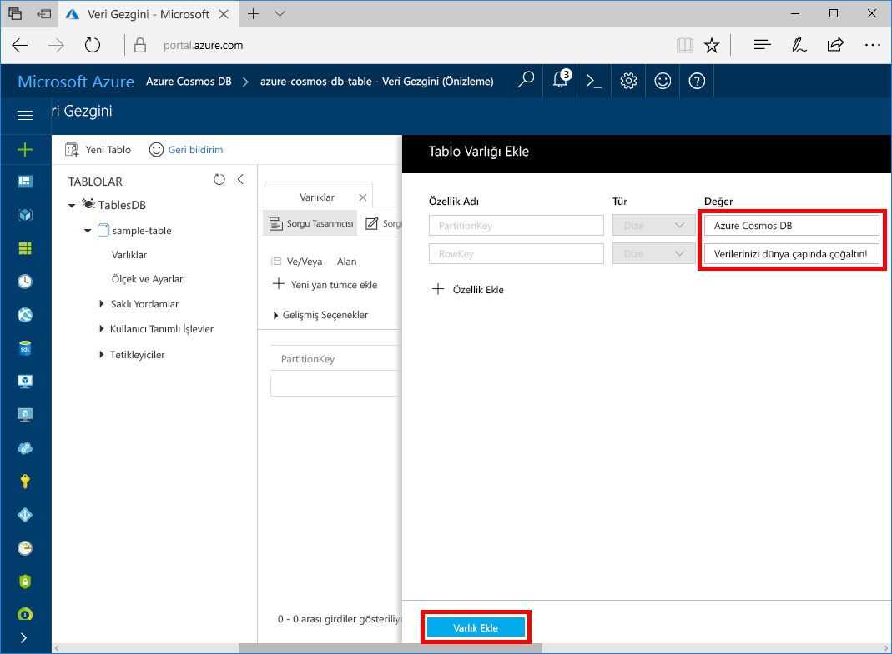

Şimdi Veri Gezgini'ni kullanarak yeni tablonuza veri ekleyebilirsiniz.

1. Veri Gezgini'nde **sample-table** seçeneğini genişletin, **Varlıklar**'a ve ardından **Varlık Ekle**'ye tıklayın.

   
2. Şimdi PartitionKey değer kutusu ile RowKey değer kutusuna verileri ekleyin ve **Varlık Ekle**’ye tıklayın.

   
  
    Artık tablonuza daha fazla varlık ekleyebilir, varlıklarınızı düzenleyebilir veya Veri Gezgini’nde verilerinizi sorgulayabilirsiniz. Veri Gezgini ayrıca aktarım hızınızı ölçeklendirebileceğiniz ve tablonuza depolanmış yordamlar, kullanıcı tarafından tanımlanmış işlevler ve tetikleyiciler ekleyebileceğiniz yerdir.