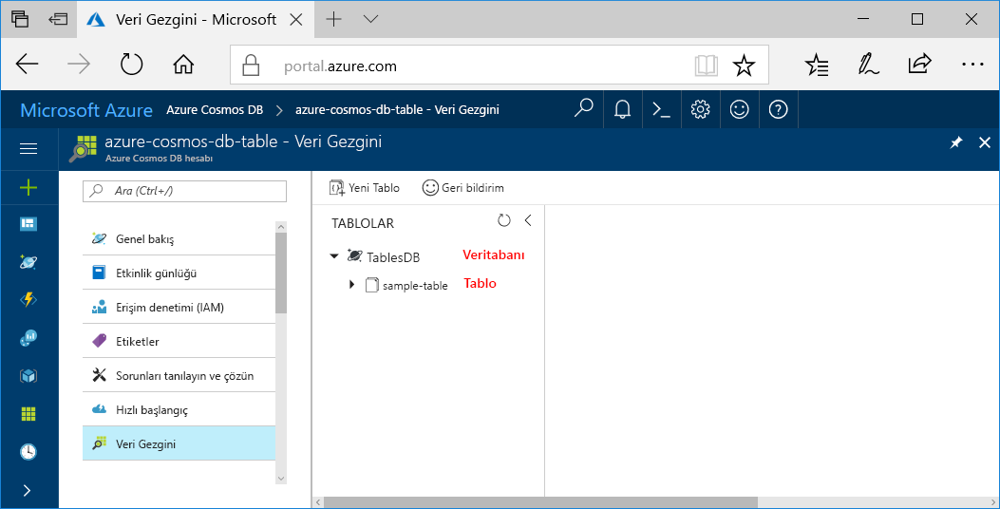

Şimdi bir veritabanı ve tablo oluşturmak için Azure portalında Veri Gezgini aracını kullanabilirsiniz. 

1. **Veri Gezgini** > **Yeni Tablo**’ya tıklayın. 
    
    **Tablo Ekle** alanı en sağda görüntülenir, görmek için sağa kaydırmanız gerekebilir.

    

2. **Tablo Ekle** sayfasında, yeni tablo için ayarları girin.

    Ayar|Önerilen değer|Açıklama
    ---|---|---
    Tablo kimliği|sample-table|Yeni tablonuzun kimliği. Tablo adı karakter gereksinimleri, veritabanı kimliklerine ilişkin karakter gereksinimleri ile aynıdır. Veritabanı adı 1 ile 255 karakter arasında olmalı, `/ \ # ?` içermemeli ve boşlukla bitmemelidir.
    Depolama kapasitesi| Sabit (10 GB)|Varsayılan **Sabit (10 GB)** değerini kullanın. Bu değer, veritabanının depolama kapasitesidir.
    Aktarım hızı|400 RU|Aktarım hızını saniyede 400 istek birimi (RU/s) olarak değiştirin. Daha sonra gecikme süresini azaltmak isterseniz aktarım hızının ölçeğini artırabilirsiniz.

    **Tamam**’a tıklayın.

    Veri Gezgini, yeni veritabanını ve tabloyu görüntüler.

    