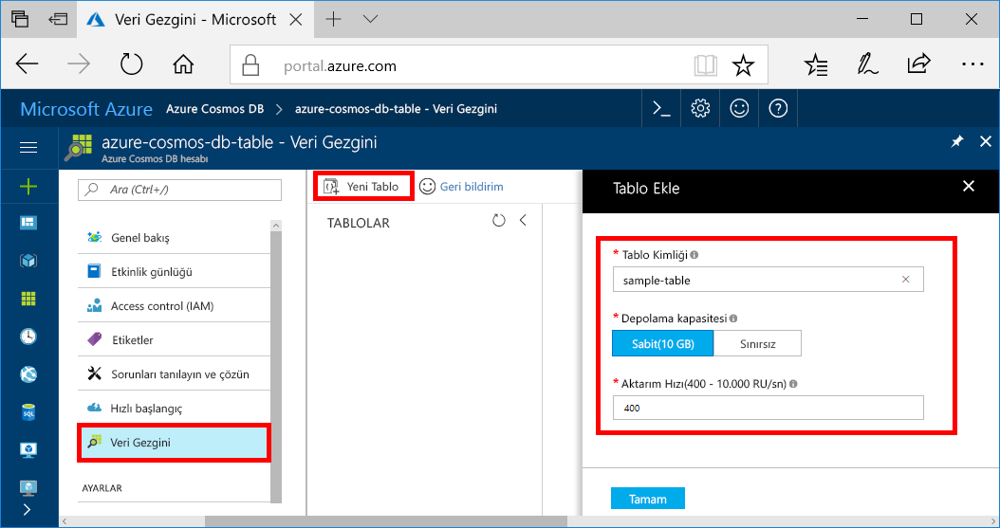

Artık Veri Gezgini'ni kullanarak bir tablo oluşturabilir ve veritabanınıza veri ekleyebilirsiniz. 

1. Azure portalındaki gezinti menüsünde **Veri Gezgini (Önizleme)** seçeneğine tıklayın. 
2. Veri Gezgini dikey penceresinde **Yeni Tablo**'ya tıklayın ve aşağıdaki bilgileri kullanarak sayfayı doldurun.

    

    Ayar|Önerilen değer|Açıklama
    ---|---|---
    Tablo kimliği|sample-table|Yeni tablonuzun kimliği. Tablo adı karakter gereksinimleri, veritabanı kimliklerine ilişkin karakter gereksinimleri ile aynıdır. Veritabanı adı 1 ile 255 karakter arasında olmalı, `/ \ # ?` içermemeli ve boşlukla bitmemelidir.
    Depolama kapasitesi| 10 GB|Varsayılan değeri değiştirmeyin. Bu, veritabanının depolama kapasitesidir.
    Aktarım hızı|400 RU|Varsayılan değeri değiştirmeyin. Daha sonra gecikme süresini azaltmak isterseniz [aktarım hızının](../articles/cosmos-db/request-units.md) ölçeğini artırabilirsiniz.
    RU/dk|Kapalı|Varsayılan değeri kullanın.

3. Formu doldurduktan sonra **Tamam**'a tıklayın.