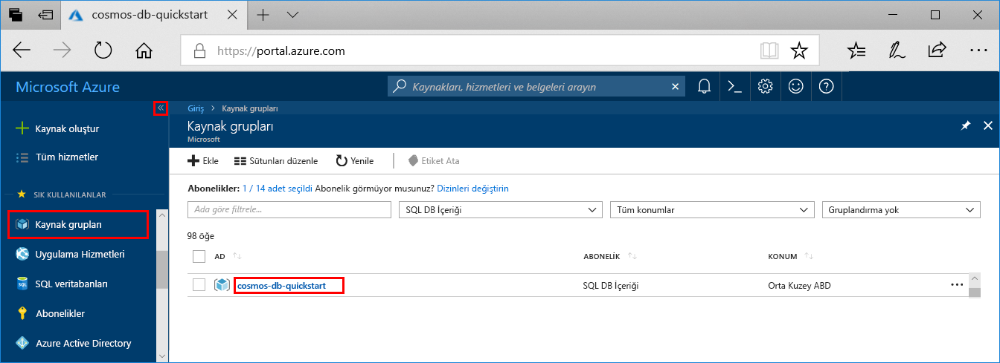
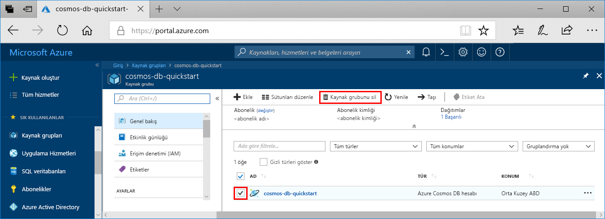

Azure Cosmos DB hesabı ve web uygulaması ile işiniz bittiğinde, daha fazla ücret ödememeniz oluşturduğunuz Azure kaynaklarını silebilirsiniz. Kaynakları silmek için:

1. Azure portalının en sol tarafındaki **Kaynak gruplarını** seçin. Soldaki menü daraltılmışsa, seçin  genişletin.

2. Bu Hızlı Başlangıç için oluşturduğunuz kaynak grubunu seçin.  

    

2. Yeni pencerede seçin **kaynak grubunu Sil**.

       

3. Sonraki penceresinde adını, kaynak grubunu silin ve ardından **Sil**.