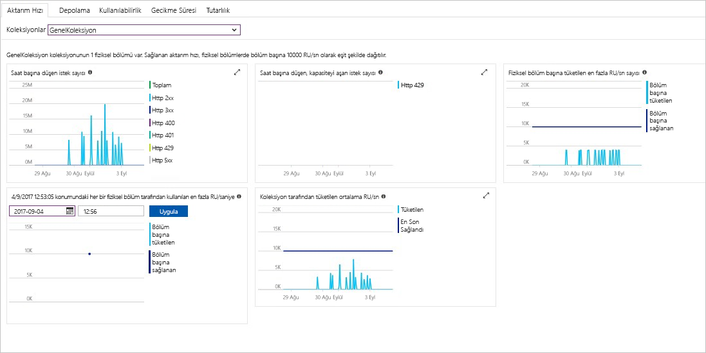

Azure portalı, Cosmos DB hesabı aktarım hızını, depolama, kullanılabilirlik, gecikme süresi ve tutarlılık izler. Grafikler ile ilgili ölçümler için bir [Azure Cosmos DB hizmet düzeyi sözleşmesi (SLA)](https://azure.microsoft.com/support/legal/sla/cosmos-db/) gerçek performans karşılaştırıldığında SLA değeri gösterir. Bu paketi ölçümleri saydam, SLA izleme sağlar.

Ölçümler ve SLA'ları gözden geçirmek için: 

1. Seçin **ölçümleri** Cosmos DB hesabınızın Gezinti menüsünde.
   
2. Bir sekme gibi seçin **gecikme**, sağ taraftaki bir zaman çerçevesi'ni seçin. Karşılaştırma **gerçek** ve **SLA** grafikleri satırlarda.
   
   
   
3. Diğer sekmelerdeki ölçümleri gözden geçirin. 

