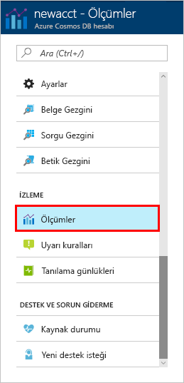

Hesabınızdaki kaynakların aktarım hızı, depolaması, kullanılabilirliği, gecikme süresi ve tutarlılığı Azure portalda izlenir. Bu ölçümlere hızlıca bir göz atalım. 

1. Gezinti menüsünde **Ölçümler**’e tıklayın.

   

2. Azure Cosmos DB’nin sağladığı ölçümlerin farkında olmanız için sekmelerin her birine tıklayın. 

    [Azure Cosmos DB Hizmet Düzeyi Sözleşmeleri (SLA'lar)](https://azure.microsoft.com/support/legal/sla/cosmos-db/) ile ilişkili her grafik, SLA’lardan birinin ihlal edilip edilmediğini gösteren bir satır sağlar. Azure Cosmos DB, bu ölçüm paketi ile SLA’larınızı izlemeyi şeffaf hale getirir. 

   