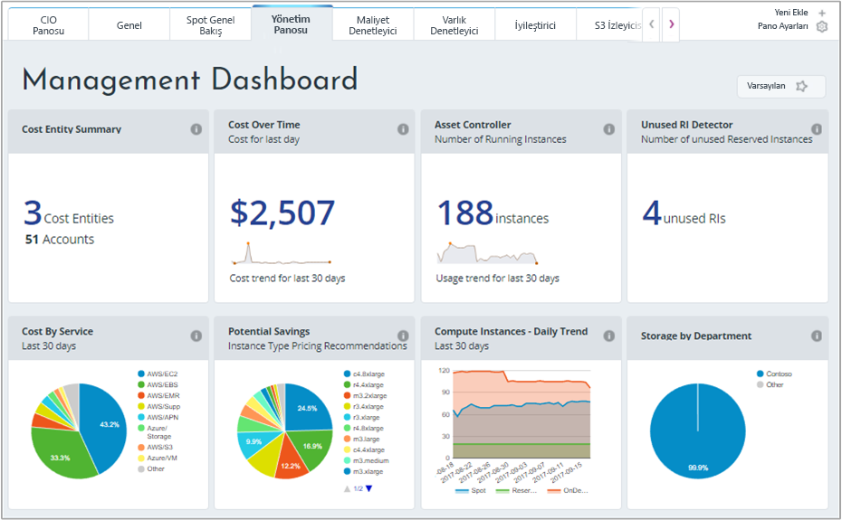
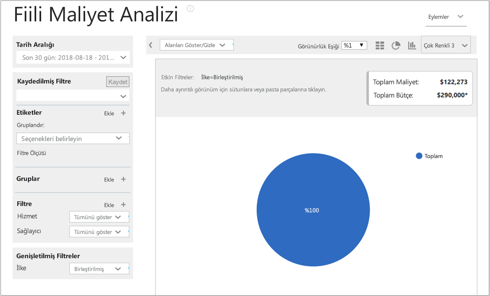
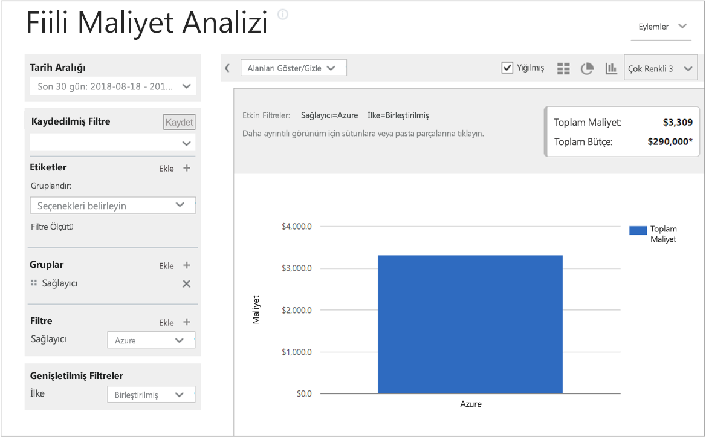
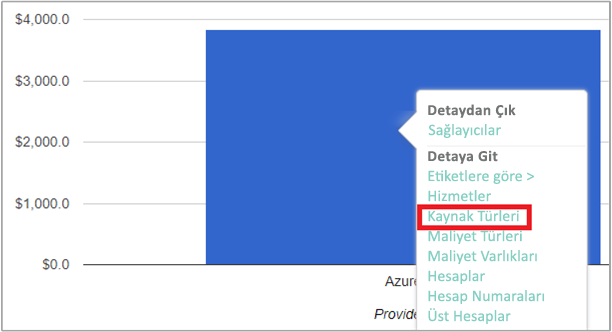
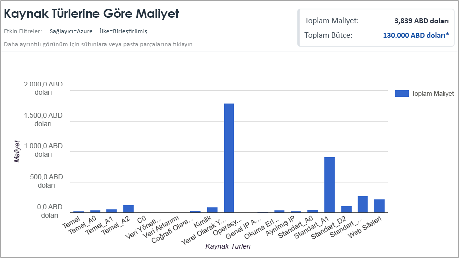
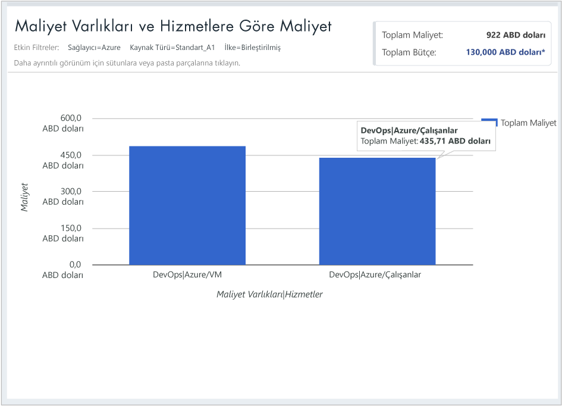

## Maliyet verilerini görüntüleme

Cloudyn'in sunduğu Azure Maliyet Yönetimi, bulut kaynak verilerinizin tamamına erişmenizi sağlar. Pano halinde sunulan raporlarda hem standart hem de özel raporları sekmeler halinde görüntüleyebilirsiniz. Aşağıda maliyet verilerini doğrudan görebileceğiniz popüler panolar ve rapor örnekleri gösterilmiştir.

Bu örnekte Yönetim panosu Contoso şirketinin tüm bulut kaynaklarına ait toplam maliyetleri göstermektedir. Contoso şirketi Azure, AWS ve Google hizmetlerini kullanmaktadır. Panolar bir bakışta görülebilecek bilgiler ve raporlarda gezinmek için pratik bir yol sunmaktadır.  

Panoda yer alan bir raporun amacı konusunda bilginiz yoksa **i** simgesinin üzerine gelerek açıklamasına göz atabilirsiniz. Panoda yer alan bir raporun tamamını görüntülemek için üzerine tıklamanız yeterlidir.

Raporları görüntülemek için portalın en üst bölümünde yer alan raporlar menüsünü de kullanabilirsiniz. Şimdi Contoso'nun son 30 gün içindeki Azure kaynağı harcamalarına göz atalım. **Maliyet** > **Maliyet Analizi** > **Gerçek Maliyet Analizi**’ne tıklayın. Varsa raporunuzdaki etiket, grup veya filtre değerlerini silin.

Bu örnekte toplam maliyet 122.273 USD, bütçe ise 290.000 USD’dir.

Şimdi rapor biçimini değiştirerek grupları ve filtreleri Azure maliyetlerini gösterecek şekilde ayarlayalım. **Date Range** (Tarih Aralığı) için son 30 günü seçin. Sağ üst bölümde sütun simgesine tıklayarak çubuk grafik biçimini seçin ve Groups (Gruplar) bölümünde **Provider** (Sağlayıcı) öğesini belirleyin. Ardından **Provider** (Sağlayıcı) için **Azure** filtresi oluşturun.

Bu örnekte son 30 güne ait Azure kaynakları toplam maliyeti 3.309 USD olmuştur.

Provider (Azure) (Sağlayıcı) çubuğuna sağ tıklayın ve **Resource types** (Kaynak türleri) detayına gidin.

Aşağıdaki resimde Contoso'nun ödemesi gereken Azure kaynakları maliyeti gösterilmiştir. Toplam 3.309 USD’dir. Bu örnekte maliyetin yarısına yakını Standard_A1 sanal makineleri için, diğer yarısı ise çeşitli Azure hizmetleri ve sanal makine örnekleri için tahakkuk ettirilmiştir.

Bir kaynağı tüketen maliyet varlıklarını ve hizmetleri görüntülemek için kaynak türüne sağ tıklayıp **Cost Entities** (Maliyet Varlıkları) öğesini seçin. Aşağıdaki örnek görüntüde Kaynak türü olarak Yerel Olarak Yedekli Depolama ayarlanmıştır. Contoso|Azure/Kullanılan depolama 15.65 USD. Mühendislik | Kullanılan Azure Depolama 164.25 USD. Paylaşılan Altyapı | Azure/Kullanılan Depolama 116.58 USD. Hizmetler için toplam maliyet 296 USD'dir.

Bulut faturalama verilerinizi görüntüleme hakkında öğretici bir video izlemek için bkz. [Cloudyn Azure Maliyet Yönetimi ile bulut faturalama verilerinizi çözümleme](https://youtu.be/G0pvI3iLH-Y).
