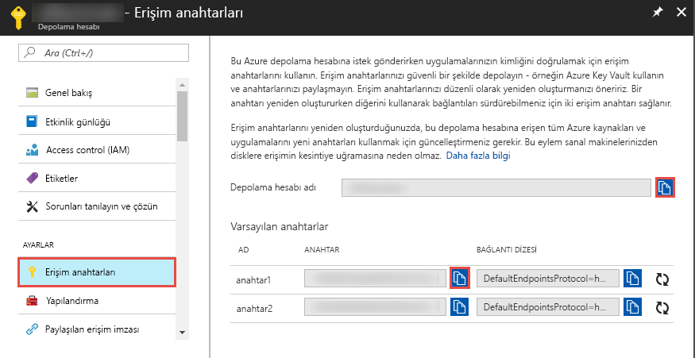

## <a name="prerequisites"></a>Önkoşullar

### <a name="azure-subscription"></a>Azure aboneliği
Azure aboneliğiniz yoksa başlamadan önce [ücretsiz bir hesap](https://azure.microsoft.com/free/) oluşturun.

### <a name="azure-roles"></a>Azure rolleri
Data Factory örnekleri oluşturmak için, Azure’da oturum açarken kullandığınız kullanıcı hesabı, *katkıda bulunan*, *sahip* veya *yönetici* rollerinin üyesi ya da bir Azure aboneliğinin yöneticisi olmalıdır. Abonelikte sahip olduğunuz izinleri görüntülemek için Azure portalına gidin, sağ üst köşeden kullanıcı adınızı ve sonra **İzinler**’i seçin. Birden çok aboneliğe erişiminiz varsa uygun aboneliği seçin. 

Data Factory için veri kümeleri, bağlı hizmetler, işlem hatları, tetikleyiciler ve tümleştirme çalışma zamanları gibi alt kaynaklar oluşturup yönetmek için aşağıdaki gereksinimlerin karşılanması gerekir:
- Azure portalda alt öğe oluşturup yönetebilmek için kaynak grubu düzeyinde **Data Factory Katılımcısı** rolüne veya daha üst düzey bir role sahip olmanız gerekir.
- PowerShell veya SDK ile alt öğe oluşturup yönetebilmek için kaynak düzeyinde **katkıda bulunan** rolü veya daha üst düzey bir rol yeterli olacaktır.

Kullanıcı rolü eklemeye ilişkin örnek yönergeler için [Rol ekleme](../articles/billing/billing-add-change-azure-subscription-administrator.md) makalesine bakın.

Daha fazla bilgi için aşağıdaki makalelere bakın:
- [Data Factory Katılımcısı rolü](../articles/role-based-access-control/built-in-roles.md#data-factory-contributor)
- [Azure Data Factory için roller ve izinler](../articles/data-factory/concepts-roles-permissions.md)

### <a name="azure-storage-account"></a>Azure depolama hesabı
Bu hızlı başlangıçta, genel amaçlı Azure depolama hesabını (özel olarak Blob depolama) hem *kaynak* hem de *hedef* veri deposu olarak kullanırsınız. Genel amaçlı bir Azure depolama hesabınız yoksa oluşturma bilgileri için bkz. [Depolama hesabı oluşturma](../articles/storage/common/storage-quickstart-create-account.md). 

#### <a name="get-the-storage-account-name-and-account-key"></a>Depolama hesabı adını ve hesap anahtarını alma
Bu hızlı başlangıçta, Azure depolama hesabınızın adına ve anahtarına ihtiyacınız olacaktır. Aşağıdaki yordamda, depolama hesabınızın adını ve anahtarını alma adımlarını verilmiştir: 

1. Bir web tarayıcısında [Azure portalına](https://portal.azure.com) gidin. Azure kullanıcı adınızı ve parolanızı kullanarak oturum açın. 
2. Sol taraftaki menüde **Tüm hizmetler**’i seçin, **Depolama** anahtar sözcüğünü kullanarak filtre uygulayın ve **Depolama hesapları**'nı seçin.

   
3. Depolama hesapları listesinde, depolama hesabınız için filtre uygulayın (gerekirse) ve depolama hesabınızı seçin. 
4. **Depolama hesabı** sayfasında, menüden **Erişim anahtarları**'nı seçin.

   
5. **Depolama hesabı adı** ve **key1** kutularının değerlerini panoya kopyalayın. Bunları Not Defteri’ne veya başka bir düzenleyiciye yapıştırın ve kaydedin. Bunları daha sonra bu hızlı başlangıçta kullanacaksınız.   

#### <a name="create-the-input-folder-and-files"></a>Giriş klasörünü ve dosyaları oluşturma
Bu bölümde, Azure Blob depolama alanında **adftutorial** adlı bir blob kapsayıcısı oluşturursunuz. Kapsayıcıda **giriş** adlı bir klasör oluşturur ve giriş klasörüne örnek bir dosya yüklersiniz. 

1. **Depolama hesabı** sayfasında **Genel Bakış**’a geçin ve sonra **Bloblar**’ı seçin. 

   
2. **Blob hizmeti** sayfasında, araç çubuğundaki **+ Kapsayıcı**’yı seçin. 

       
3. **Yeni kapsayıcı** iletişim kutusunda ad olarak **adftutorial** girin ve ardından **Tamam**’ı seçin. 

   
4. Kapsayıcılar listesinde **adftutorial**’ı seçin. 

   
5. **Kapsayıcı** sayfasında araç çubuğundaki **Karşıya Yükle** öğesini seçin.  

   
6. **Blobu karşıya yükleme** sayfasında **Gelişmiş**’i seçin.

   
7. **Not Defteri**'ni başlatın ve aşağıdakileri içeren **emp.txt** adlı bir dosya oluşturun: Bu dosyayı **c:\ADFv2QuickStartPSH** klasörüne kaydedin. Yoksa **ADFv2QuickStartPSH** klasörünü oluşturun.
    
   ```
   John, Doe
   Jane, Doe
   ```    
8. Azure portalında **Blobu karşıya yükleme** sayfasından **Dosyalar** kutusu için **emp.txt** dosyasına göz atıp seçin. 
9. **Klasöre yükle** kutusuna **input** değerini girin. 

        
10. Klasörün **input**, dosyanın ise **emp.txt** olduğunu onaylayıp **Karşıya Yükle**’yi seçin.
    
    Listede **emp.txt** dosyasını ve karşıya yükleme durumunu görmeniz gerekir. 
12. Köşedeki **X** simgesine tıklayarak **Blobu karşıya yükleme** sayfasını kapatın. 

    
1. **Kapsayıcı** sayfasını açık tutun. Bu hızlı başlangıcın sonundaki çıktıyı doğrulamak için bu sayfayı kullanırsınız.