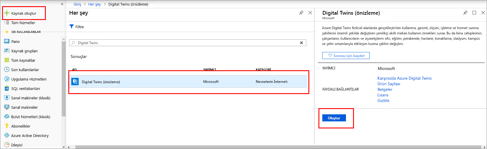
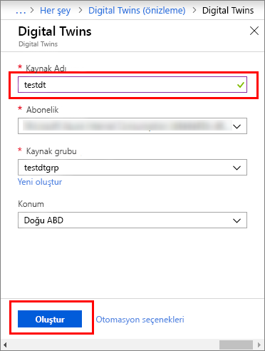
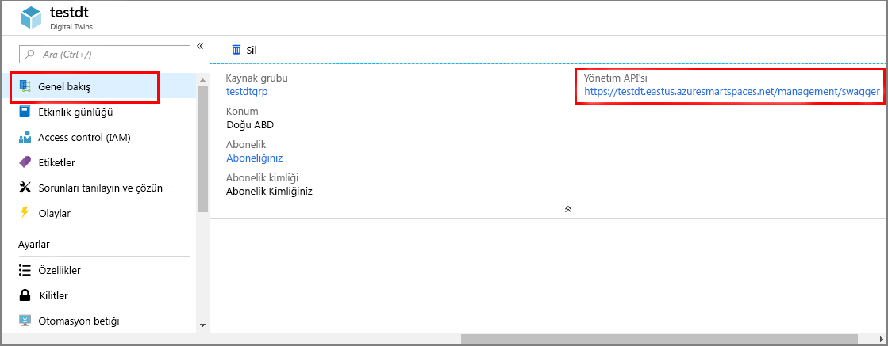

1. [Azure Portal](http://portal.azure.com) oturum açın.

1. Sol bölmeden **kaynak Oluştur**. Arama **dijital ikizlerini**seçip **dijital İkizlerini**. Seçin **Oluştur** dağıtım işlemini başlatmak için.

   

1. **Digital Twins** bölmesine şu bilgileri girin:
   * **Kaynak adı**: Dijital İkizlerini Örneğiniz için benzersiz bir ad oluşturun.
   * **Abonelik**: Bu dijital İkizlerini örneği oluşturmak için kullanmak istediğiniz aboneliği seçin. 
   * **Kaynak grubu**: Seçin veya oluşturun bir [kaynak grubu](https://docs.microsoft.com/azure/azure-resource-manager/resource-group-overview#resource-groups) dijital İkizlerini örneği.
   * **Konum**: Cihazlarınıza en yakın konumu seçin.

     

1. Dijital İkizlerini bilgilerinizi gözden geçirin ve ardından **Oluştur**. Dijital İkizlerini örneğinizin oluşturulması birkaç dakika sürebilir. İlerleme durumunu **Bildirimler** bölmesinden izleyebilirsiniz.

1. Digital Twins örneğinizin **Genel Bakış** bölmesini açın. Altındaki bağlantıyı Not **yönetim API**.

   **Yönetim API** URL olarak biçimlendirileceğini `https://yourDigitalTwinsName.yourLocation.azuresmartspaces.net/management/swagger`. Bu URL, örneğiniz için geçerli olan Azure Digital Twins REST API belgesini açar. Bu API belgelerini okumayı ve kullanmayı öğrenmek için bkz. [Azure Digital Twins Swagger'ı kullanma](../articles/digital-twins/how-to-use-swagger.md).

    Değiştirme **yönetim API** URL bu biçime `https://yourDigitalTwinsName.yourLocation.azuresmartspaces.net/management/api/v1.0/`. Uygulamanız, değiştirilen URL'yi örneğinize erişmek için temel URL olarak kullanır. Değiştirdiğiniz URL'yi geçici bir dosyaya kopyalayın. Sonraki bölümde bu anahtar gerekir.

    