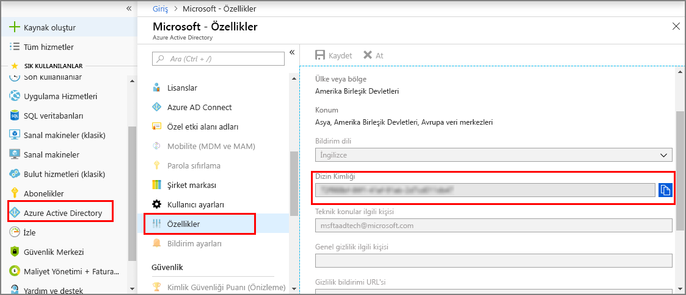
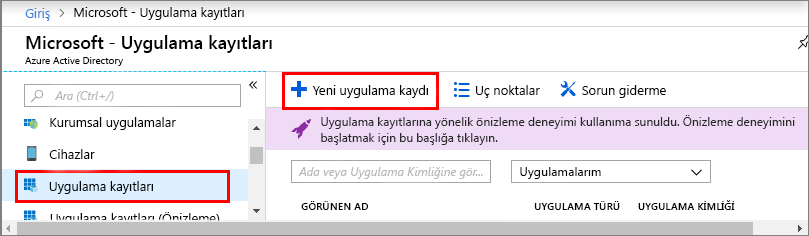
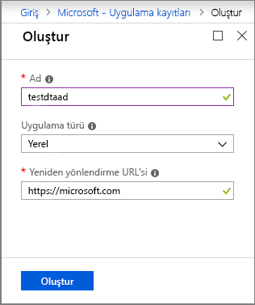
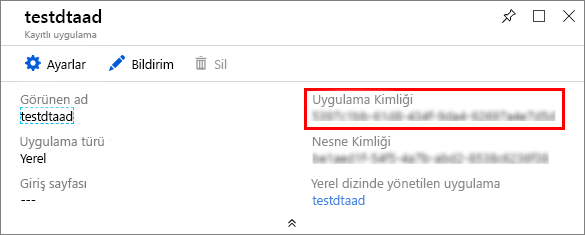

1. İçinde [Azure portalında](https://portal.azure.com)açın **Azure Active Directory** sol bölmeden ve ardından açık **özellikleri** bölmesi. **Dizin Kimliğini** geçici bir dosyaya kopyalayın. Sonraki bölümde örnek bir uygulama yapılandırmak için bu değeri kullanacaksınız.

    

1. Açık **uygulama kayıtları** bölmesinde tıklayın ve ardından **yeni uygulama kaydı** düğmesi.

    

1. Bu uygulama kaydında için kolay bir ad verin **adı** kutusu. Seçin **uygulama türü** olarak **yerel**, ve **yeniden yönlendirme URI'si** olarak `https://microsoft.com`. **Oluştur**’u seçin.

    

1. Kayıtlı uygulama açın ve değerini kopyalayın **uygulama kimliği** geçici bir dosya alanı. Bu değer, Azure Active Directory uygulamanızı tanımlar. Uygulama kimliği, örnek uygulamanızı aşağıdaki bölümlerde yapılandırmak için kullanırsınız.

    

1. Uygulamanızı uygulama kayıt bölmesini açın. Seçin **ayarları** > **gerekli izinler**ve ardından:

   a. Seçin **Ekle** açmak için üst sol taraftaki **API erişimi Ekle** bölmesi.

   b. Seçin **bir API seçin** araması **Azure dijital İkizlerini**. Arama sonucunda API görüntülenmezse **Azure Smart Spaces** araması yapın.

   c. Seçin **Azure dijital İkizlerini (Azure akıllı alanları Service)** seçenek ve **seçin**.

   d. Seçin **izinleri seçin**. Seçin **okuma/yazma erişimi** temsilci izinleri kutusunu işaretleyin ve **seçin**.

   e. Seçin **Bitti** içinde **API erişimi Ekle** bölmesi.

   f. İçinde **gerekli izinler** bölmesinde **izinleri verin** düğmesine ve görüntülenen bildirim kabul edin.

      
