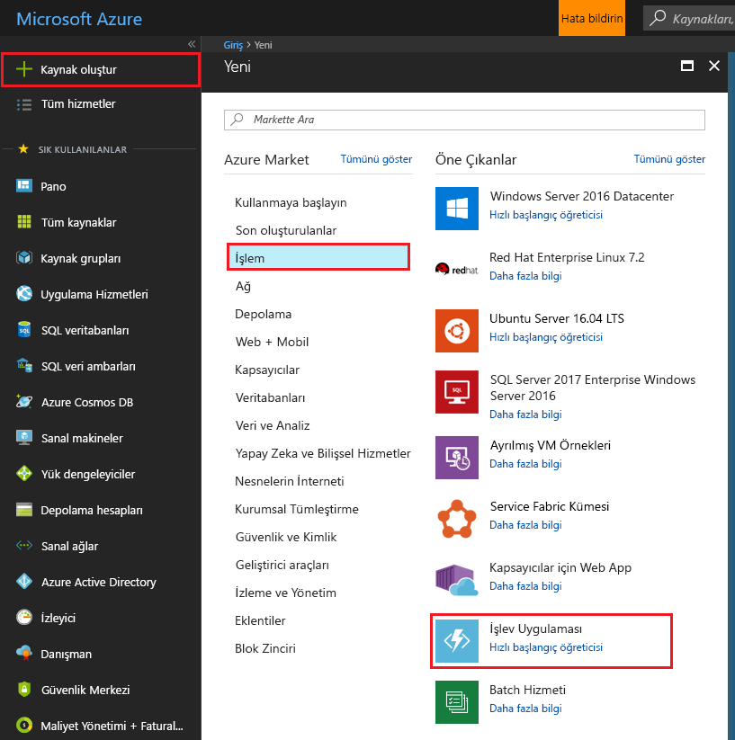
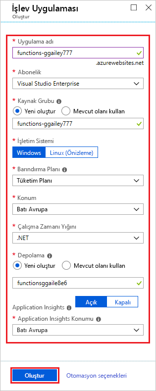
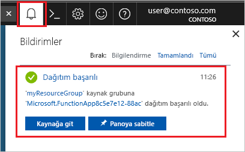

1. Seçin **kaynak Oluştur** düğmesi bulunan Azure portalında, sol üst köşesinde ardından seçin **işlem** > **işlev uygulaması**.

    

2. Görüntünün altındaki tabloda belirtilen işlev uygulaması ayarlarını kullanın.

    

    | Ayar      | Önerilen değer  | Açıklama                                        |
    | ------------ |  ------- | -------------------------------------------------- |
    | **Uygulama adı** | Genel olarak benzersiz bir ad | Yeni işlev uygulamanızı tanımlayan ad. Geçerli karakterler: `a-z`, `0-9`, ve `-`.  | 
    | **Abonelik** | Aboneliğiniz | Bu yeni işlev uygulamasının oluşturulduğu abonelik. | 
    | **[Kaynak Grubu](../articles/azure-resource-manager/resource-group-overview.md)** |  myResourceGroup | İşlev uygulamanızın oluşturulacağı yeni kaynak grubunun adı. |
    | **OS** | Windows | Linux'ta sunucusuz barındırma şu anda Önizleme aşamasındadır. Daha fazla bilgi için [konuları makalede](https://aka.ms/funclinux).|
    | **[Barındırma planı](../articles/azure-functions/functions-scale.md)** | Tüketim planı | Kaynakların işlev uygulamanıza nasıl ayrılacağını tanımlayan barındırma planı. Varsayılan **Tüketim Planı**'nda kaynaklar işlevlerin taleplerine göre dinamik olarak eklenir. Bu [sunucusuz](https://azure.microsoft.com/overview/serverless-computing/) barındırmada, yalnızca işlevlerinizin çalıştığı süre için ödeme yaparsınız. Bir App Service planı içinde çalıştırdığınızda [işlev uygulamanızın ölçeklendirmesini](../articles/azure-functions/functions-scale.md) yönetmeniz gerekir.  |
    | **Konum** | Batı Avrupa | Kendinize veya işlevinizin erişeceği diğer hizmetlere yakın bir [bölge](https://azure.microsoft.com/regions/) seçin. |
    | **Çalışma zamanı yığını** | Tercih edilen dil | Tercih ettiğiniz işlev programlama dilini destekleyen bir çalışma zamanı seçin. C# ve F# için **.NET** işlevlerini seçin. |
    | **[Depolama](../articles/storage/common/storage-quickstart-create-account.md)** |  Genel olarak benzersiz bir ad |  İşlev uygulamanız tarafından kullanılan bir depolama hesabı oluşturun. Depolama hesabı adları 3 ile 24 karakter arasında olmalı ve yalnızca sayıyla küçük harf içermelidir. Dilerseniz [depolama hesabı gereksinimlerini](../articles/azure-functions/functions-scale.md#storage-account-requirements) karşılayan mevcut bir hesap da kullanabilirsiniz. |
    | **[Application Insights](../articles/azure-functions/functions-monitoring.md)** | Varsayılan | Bir Application Insights kaynağı aynı oluşturur *uygulama adı* , desteklenen en yakın bölgesinde. Bu ayar genişleterek değiştirebilirsiniz **yeni kaynak adı** veya farklı bir seçim **konumu** içinde bir [her Azure coğrafyası](https://azure.microsoft.com/global-infrastructure/geographies/) istediğiniz verileri depolamak. |

3. İşlev uygulamasını sağlamak ve dağıtmak için **Oluştur**'u seçin.

4. Portalın sağ üst köşesindeki Bildirim simgesini seçin ve **Dağıtım başarılı** iletisini bekleyin.

    

5. Yeni işlev uygulamanızı görüntülemek için **Kaynağa git**’i seçin.

> [!TIP]
> Portalda işlev uygulamalarınızı bulma konusunda sorun yaşıyorsanız, [Azure portalında İşlev Uygulamalarını sık kullanılanlarınıza eklemeyi](../articles/azure-functions/functions-how-to-use-azure-function-app-settings.md#favorite) deneyin.
