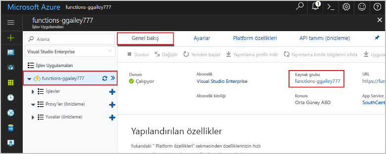

Bu koleksiyondaki diğer hızlı başlangıçlar, bu hızlı başlangıca göre belirlenir. Sonraki hızlı başlangıçlar, öğreticiler veya bu hızlı başlangıçta oluşturduğunuz hizmetlerin herhangi biri ile çalışmayı planlıyorsanız, kaynakları temizlemeyin.

Azure’da *Kaynaklar*; işlev uygulamalarını, işlevleri, depolama hesaplarını ve benzeri öğeleri ifade eder. *Kaynak grupları* halinde gruplandırılırlar ve bir grubu silerek içindeki her şeyi silebilirsiniz. 

Bu hızlı başlangıçları tamamlamak için kaynaklar oluşturdunuz. [Hesap durumunuza](https://azure.microsoft.com/account/) ve [hizmet fiyatlandırmanıza](https://azure.microsoft.com/pricing/) bağlı olarak size bu kaynakların ücretleri yansıtılabilir. Kaynaklara artık ihtiyacınız yoksa, şunları yaparak silebilirsiniz:

1. Azure portalında **Kaynak grubu** sayfasına gidin. 

   Söz konusu sayfaya işlev uygulaması sayfasından ulaşmak için **Genel Bakış** sekmesini ve sonra **Kaynak grubu** altındaki bağlantıyı seçin.

   

   Söz konusu sayfaya panodan ulaşmak için **Kaynak grupları**’nı ve ardından bu hızlı başlangıç için kullandığınız kaynak grubunu seçin.

2. **Kaynak grubu** sayfasında, dahil edilen kaynakların listesini gözden geçirin ve silmek istediğiniz kaynakların bunlar olduğunu doğrulayın.
 
3. **Kaynak grubunu sil**’i seçin ve yönergeleri izleyin.

   Silme işlemi birkaç dakika sürebilir. İşlem tamamlandığında, birkaç saniye boyunca bir bildirim görüntülenir. Bildirimi görüntülemek için sayfanın üst kısmındaki zil simgesini de seçebilirsiniz.
