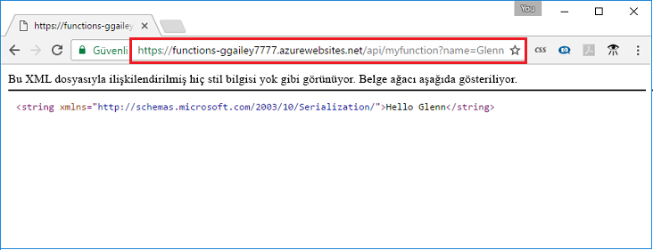

## <a name="test"></a>Azure'da işlevi test etme

Dağıtılan işlevi test etmek için cURL kullanın. Kullanarak önceki adımda kopyaladığınız URL'ye sorgu dizesi ekleme `&name=<yourname>` aşağıdaki örnekteki gibi bir URL:

```bash
curl https://myfunctionapp.azurewebsites.net/api/httptrigger?code=cCr8sAxfBiow548FBDLS1....&name=<yourname>
```

 

Ayrıca, web tarayıcınızın adres için kopyalanan URL'yi yapıştırabilirsiniz. Yeniden sorgu dizesini URL'ye `&name=<yourname>` isteği yürütmeden önce URL'si.

  
