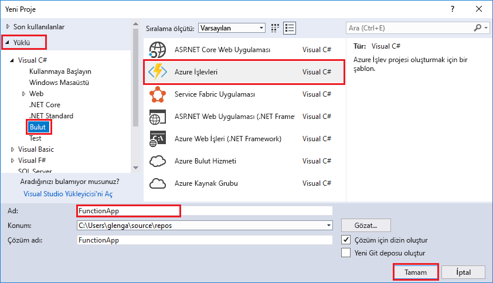
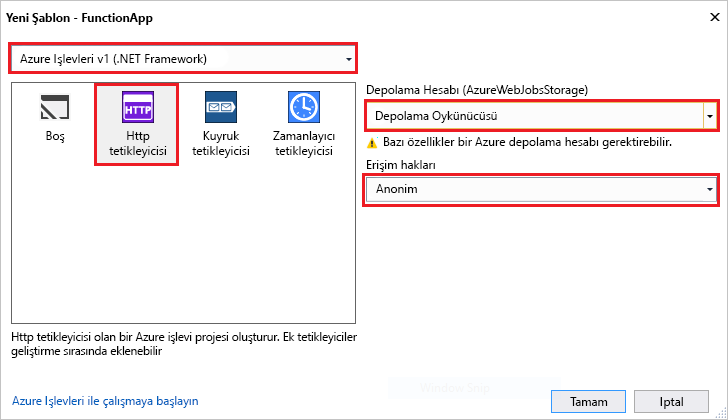

Visual Studio'daki Azure İşlevleri proje şablonu, Azure'daki bir işlev uygulamasında yayımlanabilen bir proje oluşturur. Yönetim, dağıtım ve kaynak paylaşımı, mantıksal birim olarak işlevleri Grup işlevi uygulama sağlar.   

1. Visual Studio'da seçin **yeni** > **proje** gelen **dosya** menüsü. 

2. İçinde **yeni proje** iletişim kutusunda **yüklü**, genişletin **Visual C#** > **bulut**seçin **Azure İşlevler**, bir **adı** proje ve tıklatın **Tamam**. İşlev uygulamasının adı, bir C# ad alanı olarak geçerli olmalıdır; bu nedenle alt çizgi, kısa çizgi veya alfasayısal olmayan herhangi bir karakter kullanmayın. 

     

2. Görüntünün aşağıdaki tabloda belirtilen ayarları kullanın.
 
     

    | Ayar      | Önerilen değer  | Açıklama                      |
    | ------------ |  ------- |----------------------------------------- |
    | **Sürüm** | Azure işlevleri v1  (.NET framework) | Bu sürüm 1 çalışma zamanı Azure işlevlerini kullanan bir işlev projesi oluşturur. .NET Core destekler, sürüm 2 çalışma zamanı şu anda önizlemede değil. Daha fazla bilgi için bkz: [hedef Azure işlevleri çalışma zamanı sürümü nasıl](../articles/azure-functions/functions-versions.md).   | 
    | **Şablon** | HTTP tetikleyicisi | Bu, bir HTTP isteğiyle tetiklenen bir işlev oluşturur. |
    | **Depolama hesabı**  | Depolama öykünücüsü | Bir HTTP tetikleyicisi depolama hesabı bağlantısı kullanmaz. Tüm diğer tetikleyici türleri geçerli bir depolama hesabı bağlantı dizesi gerektirir. |
    | **Erişim hakları** | Anonim | Bir anahtar sağlamadan istemciler tarafından oluşturulan işlevi tetiklenebilir. Bu yetkilendirme ayarı yeni işlevinizi test kolay hale getirir. Anahtarlar ve yetkilendirme hakkında daha fazla bilgi için bkz: [yetkilendirme anahtarları](../articles/azure-functions/functions-bindings-http-webhook.md#authorization-keys) içinde [HTTP ve Web kancası bağlamaları](../articles/azure-functions/functions-bindings-http-webhook.md). |         
3. Tıklatın **Tamam** işlevi oluşturmak için proje ve HTTP işlevi tetiklenir. 

