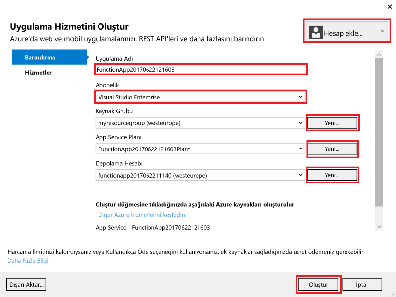
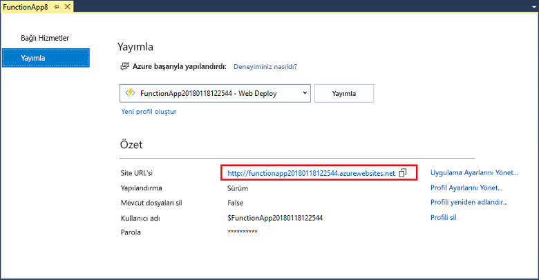

1. **Çözüm Gezgini**'nde projeye sağ tıklayın ve **Yayımla**'yı seçin. **Yeni Oluştur**'u seçin ve **Yayımla**'ya tıklayın. 

    

2. Henüz Visual Studio'yu Azure hesabınıza bağlamadıysanız **Hesap ekle...** öğesine tıklayın.  

3. **App Service Oluştur** iletişim kutusunda, aşağıdaki tabloda belirtilen **Barındırma** ayarlarını kullanın: 

    

    | Ayar      | Önerilen değer  | Açıklama                                |
    | ------------ |  ------- | -------------------------------------------------- |
    | **Uygulama Adı** | Genel olarak benzersiz bir ad | Yeni işlev uygulamanızı benzersiz şekilde tanımlayan ad. |
    | **Abonelik** | Aboneliğinizi seçin | Kullanılacak Azure aboneliği. |
    | **[Kaynak Grubu](../articles/azure-resource-manager/resource-group-overview.md)** | myResourceGroup |  İşlev uygulamanızın oluşturulacağı kaynak grubunun adı. |
    | **[App Service Planı](../articles/azure-functions/functions-scale.md)** | Tüketim planı | Yeni bir plan oluşturduğunuzda **Boyut** bölümünde **Tüketim** seçeneğini belirlediğinizden emin olun.  |
    | **[Depolama hesabı](../articles/storage/common/storage-create-storage-account.md#create-a-storage-account)** | Genel olarak benzersiz bir ad | Mevcut bir depolama hesabını kullanın veya yeni bir hesap oluşturun.   |

4. Azure'da bu ayarlara sahip bir işlev uygulaması oluşturmak için **Oluştur**'a tıklayın. Hazırlık tamamlandığında, **Site URL'si** değerini (Azure'daki işlev uygulamanızın adresi) not edin. 

    
