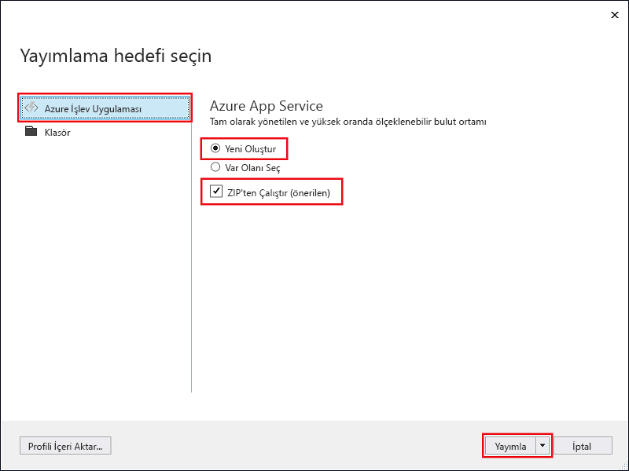

1. **Çözüm Gezgini**'nde projeye sağ tıklayın ve **Yayımla**'yı seçin.

2. **Azure İşlev Uygulaması**'nı, **Yeni Oluştur**'u ve sonra da **Yayımla**'yı seçin.

    

3. Henüz Visual Studio'yu Azure hesabınıza bağlamadıysanız **Hesap ekle...** öğesini seçin.

4. **Uygulama Hizmetini Oluştur** iletişim kutusunda, **Barındırma** ayarlarını resmin altındaki tabloda belirtildiği gibi kullanın:

    

    | Ayar      | Önerilen değer  | Açıklama                                |
    | ------------ |  ------- | -------------------------------------------------- |
    | **Uygulama Adı** | Genel olarak benzersiz bir ad | Yeni işlev uygulamanızı benzersiz şekilde tanımlayan ad. |
    | **Abonelik** | Aboneliğinizi seçin | Kullanılacak Azure aboneliği. |
    | **[Kaynak Grubu](../articles/azure-resource-manager/resource-group-overview.md)** | myResourceGroup |  İşlev uygulamanızın oluşturulacağı kaynak grubunun adı. Yeni kaynak grubu oluşturmak **Yeni**'yi seçin.|
    | **[App Service Planı](../articles/azure-functions/functions-scale.md)** | Tüketim planı | Yeni bir sunucusuz plan oluşturmak için **Yeni**’ye tıkladıktan sonra **Boyut**’un altında **Tüketim**’i seçtiğinizden emin olun. Ayrıca, kendinize veya işlevlerinizin erişeceği diğer hizmetlere yakın bir [bölgede](https://azure.microsoft.com/regions/) yer alan bir **Konum** seçin. **Tüketim** dışında bir planda çalıştırdığınızda, [işlev uygulamanızın ölçeklendirmesini](../articles/azure-functions/functions-scale.md) yönetmelisiniz.  |
    | **[Depolama Hesabı](../articles/storage/common/storage-quickstart-create-account.md)** | Genel amaçlı depolama hesabı | İşlevler çalışma zamanı için bir Azure depolama hesabı gereklidir. **Yeni**’ye tıklayarak genel amaçlı bir depolama hesabı oluşturun. Dilerseniz [depolama hesabı gereksinimlerini](../articles/azure-functions/functions-scale.md#storage-account-requirements) karşılayan mevcut bir hesap da kullanabilirsiniz.  |

5. **Oluştur**'a tıklayarak Azure'da bu ayarlarla bir işlev uygulaması ve ilgili kaynaklar oluşturun ve işlev proje kodunuzu dağıtın. 

6. Dağıtım tamamlandığında, **Site URL'si** değerini (Azure'daki işlev uygulamanızın adresi) not edin.

    
