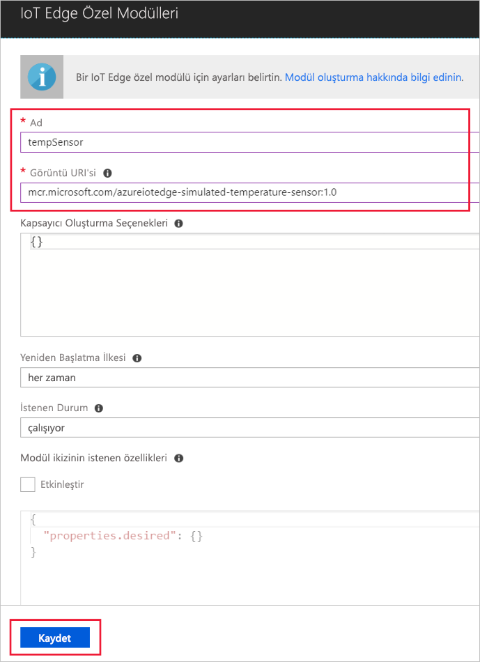

Azure IoT Edge'in önemli özelliklerinden biri buluttan IoT Edge cihazlarınıza modüller dağıtabilmektir. IoT Edge modülü, kapsayıcı olarak uygulanan yürütülebilir bir pakettir. Bu bölümde, simülasyon cihazınız için telemetri oluşturacak bir modülün dağıtımı yapacaksınız. 

1. Azure portalında IoT Hub'ınıza gidin.
1. **IoT Edge** sayfasına gidip IoT Edge cihazınızı seçin.
1. **Modülleri Ayarlama**'yı seçin.
1. Sayfanın **Dağıtım Modülleri** bölümünde **Ekle**'ye ve ardından **IoT Edge Modülü**'ne tıklayın.
1. **Ad** alanına `tempSensor` girin. 
1. **Görüntü URI'si** alanına `mcr.microsoft.com/azureiotedge-simulated-temperature-sensor:1.0` girin. 
1. Diğer ayarları değiştirmeden bırakın ve **Kaydet**'i seçin.

   

1. **Modül ekleme** adımına dönüp **İleri**’yi seçin.
1. **Rotaları belirtin** adımında tüm modüllerden gelen tüm iletileri IoT Hub'a gönderen varsayılan rotaya sahip olmanız gerekir. Yoksa aşağıdaki kodu ekleyip **İleri**'yi seçin.

   ```json
   {
       "routes": {
           "route": "FROM /* INTO $upstream"
       }
   }
   ```

1. **Dağıtımı Gözden Geçirin** adımında **Gönder**'i seçin.
1. Cihaz ayrıntıları sayfasına dönüp **Yenile**’yi seçin. Hizmeti ilk kez başlattığınızda oluşturulan edgeAgent modülüne ek olarak **edgeHub** ve **tempSensor** adlı başka bir çalışma zamanını modülünü görmeniz gerekir. 

   
