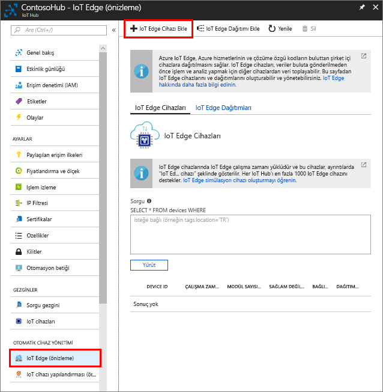

IOT hub ile iletişim kurabilmesi için sanal cihazınız için bir cihaz kimliği oluşturma. IOT sınır cihazları davranır ve tipik IOT cihazları farklı bir biçimde yönetilebilir olduğundan, bunun bir IOT sınır cihazı başlangıçtan itibaren olmasını bildirin. 

1. Azure portalında IOT hub'ına gidin.
1. Seçin **IOT kenar (Önizleme)** seçip **IOT sınır cihazı eklemek**.

   

1. Sanal cihazınız bir benzersiz cihaz kimliği verin
1. Seçin **kaydetmek** Cihazınızı eklemek için.
1. Yeni Cihazınızı aygıtları listesinden seçin.
1. Değeri kopyalama **bağlantı dizesi — birincil anahtar** ve kaydedin. Sonraki bölümde IOT kenar çalışma zamanı yapılandırmak için bu değeri kullanılır. 

