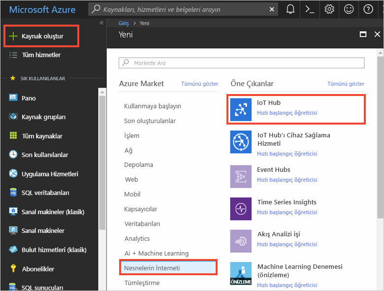
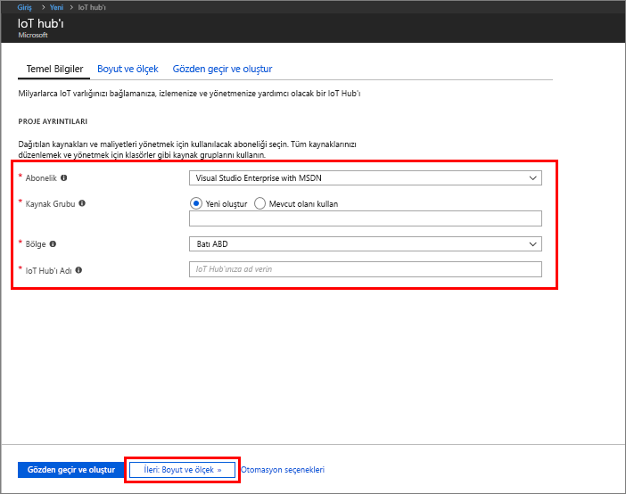
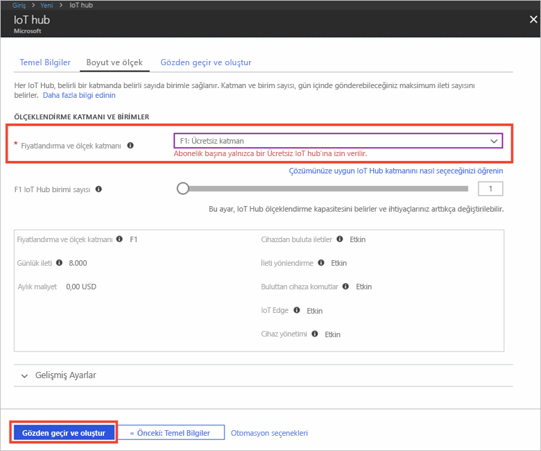

1. [Azure Portal](https://portal.azure.com/) oturum açın.

2. **Kaynak oluştur** > **Nesnelerin İnterneti** > **Iot Hub** seçeneğini belirleyin.
   
    

3. **IoT hub** bölmesine IoT hub’ınızla ilgili aşağıdaki bilgileri girin:

   * **Abonelik**: Bu IoT hub'ını oluşturmak için kullanmak istediğiniz aboneliği seçin.

   * **Kaynak grubu**: IoT hub’ını barındıracak bir kaynak grubu oluşturun veya mevcut bir kaynak grubunu kullanın. Daha fazla bilgi için bkz. [Azure kaynaklarınızı yönetmek için kaynak gruplarını kullanma](../articles/azure-resource-manager/resource-group-portal.md).

   * **Bölge**: Size en yakın konumu seçin.

   * **Ad**: IoT hub'ınız için bir ad oluşturun. Girdiğiniz ad kullanılabilir durumdaysa yeşil bir onay işareti görünür.

   [!INCLUDE [iot-hub-pii-note-naming-hub](iot-hub-pii-note-naming-hub.md)]

   

4. IoT hub’ınızı oluşturmaya devam etmek için **Sıradaki: Boyut ve ölçek** öğesini seçin. 

5. **Fiyatlandırma ve ölçek katmanınızı** seçin. Bu makale için, aboneliğinizde hala mevcutsa **F1 - Ücretsiz** katmanını seçin. Daha fazla bilgi için bkz. [Fiyatlandırma ve ölçek katmanı](https://azure.microsoft.com/pricing/details/iot-hub/).

   

6. **İncele ve oluştur**’u seçin.

7. IoT hub bilgilerinizi gözden geçirin, ardından **Oluştur**’a tıklayın. IoT hub’ınızın oluşturulması birkaç dakika sürebilir. İlerleme durumunu **Bildirimler** bölmesinden izleyebilirsiniz.