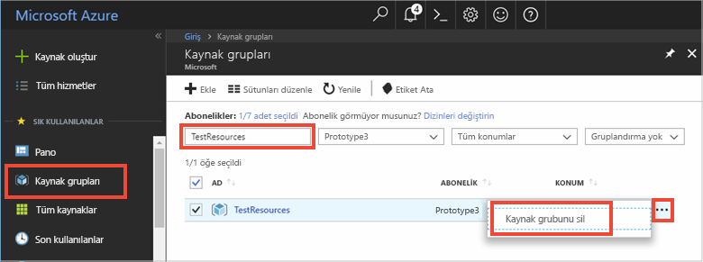

Bir sonraki önerilen makaleye geçecekseniz oluşturduğunuz kaynakları tutabilir ve yeniden kullanabilirsiniz.

Geçmeyecekseniz ücret kesilmesini önlemek için bu makalede oluşturulan Azure kaynaklarını silebilirsiniz. 

> [!IMPORTANT]
> Silinen kaynak grupları geri alınamaz. Kaynak grubu ve içindeki tüm kaynaklar kalıcı olarak silinir. Yanlış kaynak grubunu veya kaynakları yanlışlıkla silmediğinizden emin olun. IoT Hub'ı tutmak istediğiniz kaynakların bulunduğu mevcut bir kaynak grubunda oluşturduysanız kaynak grubunu silmek yerine IoT Hub kaynağını silin.
>

Bir kaynak grubunu adıyla silmek için:

1. [Azure portalında](https://portal.azure.com) oturum açın ve **Kaynak grupları**’na tıklayın.

2. **Ada göre filtrele...** metin kutusuna IoT Hub'ınızın bulunduğu kaynak grubunun adını girin. 

3. Sonuç listesinde kaynak grubunuzun sağ tarafında **...** ve sonra **Kaynak grubunu sil**'e tıklayın.

    

4. Kaynak grubunun silinmesini onaylamanız istenir. Onaylamak için kaynak grubunuzun adını tekrar yazın ve **Sil**'e tıklayın. Birkaç dakika sonra kaynak grubu ve içerdiği kaynakların tümü silinir.