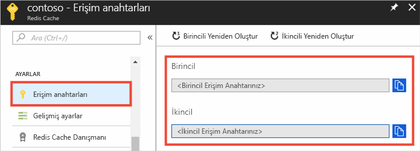
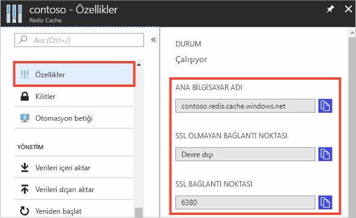

### Azure portalı kullanarak ana bilgisayar adı, bağlantı noktaları ve erişim anahtarlarını alma

Bir Azure önbelleği için Redis örneği bağlanırken, önbellek istemcileri için önbellek ana bilgisayar adı, bağlantı noktaları ve bir anahtar gerekir. Bazı istemciler bu öğelere biraz daha farklı adlarla başvurabilir. Bu bilgileri Azure portalında bulabilirsiniz.

#### Erişim tuşlarını ve ana bilgisayar adını alma

1. [Azure portalı](https://portal.azure.com) kullanarak erişim anahtarlarını almak için önbelleğinize göz atın ve **Erişim anahtarları** seçeneğini belirleyin. 

    

2. Ana bilgisayar adını ve bağlantı noktalarını almak için **Özellikler** seçeneğini belirleyin.

    

