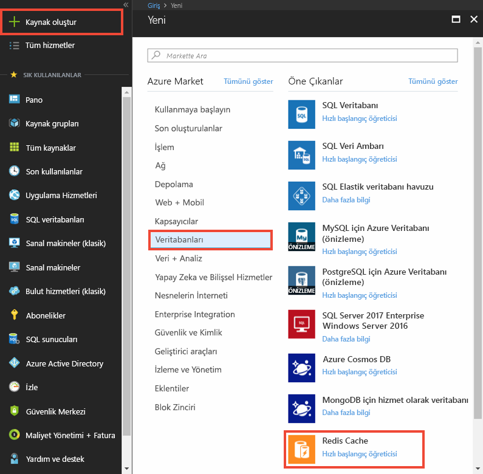
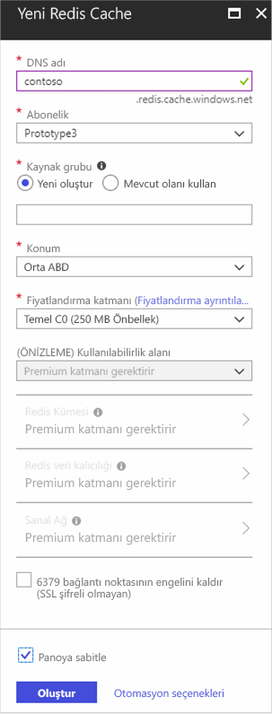
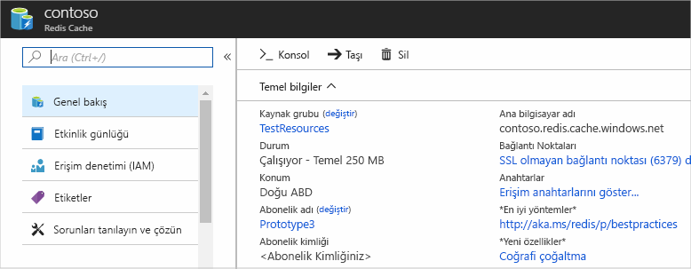

Önbellek oluşturmak için [Azure portalında](https://portal.azure.com) oturum açın; **Yeni**'ye, **Veri + Depolama**'ya ve ardından **Redis Önbelleği**'ne tıklayın.

>[AZURE.NOTE] Azure hesabınız yoksa, yalnızca birkaç dakika içinde [Ücretsiz bir Azure hesabı açabilirsiniz](https://azure.microsoft.com/pricing/free-trial/?WT.mc_id=redis_cache_hero).

>[AZURE.NOTE] Önbellekleri Azure portalında oluşturabileceğiniz gibi, Resource Manager şablonlarını, PowerShell'i veya Azure CLI'sini kullanarak da oluşturabilirsiniz.
>
>-  Resource Manager şablonlarını kullanarak bir önbellek oluşturmak için bkz. [Şablon kullanarak Redis önbelleği oluşturma](../articles/redis-cache/cache-redis-cache-arm-provision.md).
>-  Azure PowerShell kullanarak önbellek oluşturmak için bkz. [Azure PowerShell ile Azure Redis Önbelleğini Yönetme](../articles/redis-cache/cache-howto-manage-redis-cache-powershell.md).
>-  Azure CLI kullanarak önbellek oluşturmak için bkz. [Azure Komut Satırı Arabirimi (CLI Azure) kullanarak Azure Redis Önbelleği oluşturma ve yönetme](../articles/redis-cache/cache-manage-cli.md).

**Yeni Redis Önbelleği** dikey penceresinde istediğiniz yapılandırma önbelleğini belirtin.

 

-   **Dns adı**’na önbellek uç noktası için kullanılacak önbellek adını girin. Önbellek adı 1 - 63 karakter arasında bir dize olması ve yalnızca rakam, harf ve `-` karakterini içermelidir. Önbellek adı `-` karakteriyle başlayamaz veya bitemez ve ardışık `-` karakterler geçerli olmazlar.
-   **Abonelik** için önbelleğe yönelik kullanmak istediğiniz Azure aboneliğini girin. Hesabınızda yalnızca bir abonelik varsa bu otomatik olarak seçilir ve **Abonelik** açılan penceresi görüntülenmez.
-   **Kaynak grubu**’nda önbellek hesabınız için bir kaynak grubu seçin veya oluşturun. Daha fazla bilgi için bkz. [Azure kaynaklarınızı yönetmek için Kaynak gruplarını kullanma](../articles/resource-group-overview.md). 
-   Önbelleğin barındırılacağı coğrafi konumu belirtmek için **Konum**’u kullanın. En iyi performans için, Microsoft, önbelleği önbellek istemci uygulamasının olduğu konumda oluşturmanızı kesinlikle önerir.
-   İstediğiniz önbellek boyutunu ve özelliklerini seçmek için **Fiyatlandırma Katmanı**’nı kullanın.
-   **Redis kümesi**, 53 GB'den daha büyük önbellekler oluşturmanızı ve verileri birden çok Redis düğümünde paylaşmanızı sağlar. Daha fazla bilgi için bkz. [Premium Azure Redis Önbelleği için kümeleri yapılandırma](../articles/redis-cache/cache-how-to-premium-clustering.md).
-   **Redis kalıcılığı**, önbelleğiniz bir Azure Storage hesabında kalması özelliğini sunar. Kalıcılığın yapılandırılması hakkında yönergeler için bkz. [Premium Azure Redis Önbelleği için kalıcılığı yapılandırma](../articles/redis-cache/cache-how-to-premium-persistence.md).
-   **Sanal ağ** önbelleğe erişimi yalnızca belirtilen Azure Virtual Network içindeki istemcilerle sınırlayarak gelişmiş güvenlik ve yalıtım sağlar. Redis’e erişimi daha da fazla kısıtlamak için alt ağlar, erişim denetimi, ilkeler gibi VNet’in tüm özelliklerini ve diğer özellikleri kullanabilirsiniz. Daha fazla bilgi için bkz. [Premium Azure Redis Önbelleği için Sanal Ağ desteğini yapılandırma](../articles/redis-cache/cache-how-to-premium-vnet.md).

Yeni önbellek seçenekleri yapılandırıldıktan sonra **Oluştur**’a tıklayın. Önbelleğin oluşturulması birkaç dakika sürebilir. Durumu denetlemek için başlangıç panosunda ilerlemeyi izleyebilirsiniz. Önbellek oluşturulduktan sonra yeni önbelleğiniz **Çalışır** durumdadır ve [varsayılan ayarlarla](../articles/redis-cache/cache-configure.md#default-redis-server-configuration) kullanıma hazırdır.

<!--HONumber=Sep16_HO3-->

