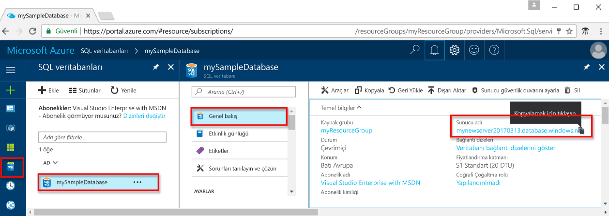

<!-- sql-database-connect-query-prerequisites-server-connection-info-includes.md 

## SQL server connection information
-->

Azure SQL veritabanına bağlanmak için gereken bağlantı bilgilerini alın. Sonraki yordamlarda tam sunucu adına, veritabanı adına ve oturum açma bilgilerine ihtiyacınız olacaktır.

1. [Azure Portal](https://portal.azure.com/) oturum açın.
2. Soldaki menüden **SQL Veritabanları**’nı seçin ve **SQL veritabanları** sayfasında veritabanınıza tıklayın. 
3. Veritabanınızın **Genel Bakış** sayfasında, aşağıdaki görüntüde gösterildiği gibi tam sunucu adını gözden geçirin. Sunucu adının üzerine gelerek **Kopyalamak için tıklayın** seçeneğini ortaya çıkarabilirsiniz.  

    

4. Sunucunuzun oturum açma bilgilerini unuttuysanız SQL Veritabanı sunucusunun sayfasına giderek sunucu yöneticisi adını görüntüleyin. Gerekirse parolayı sıfırlayın.

