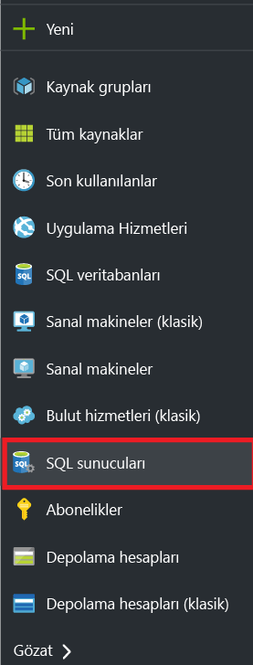
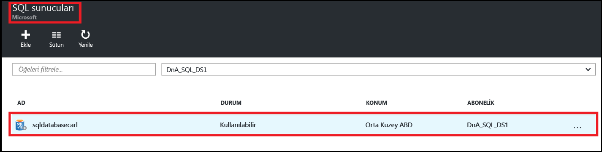
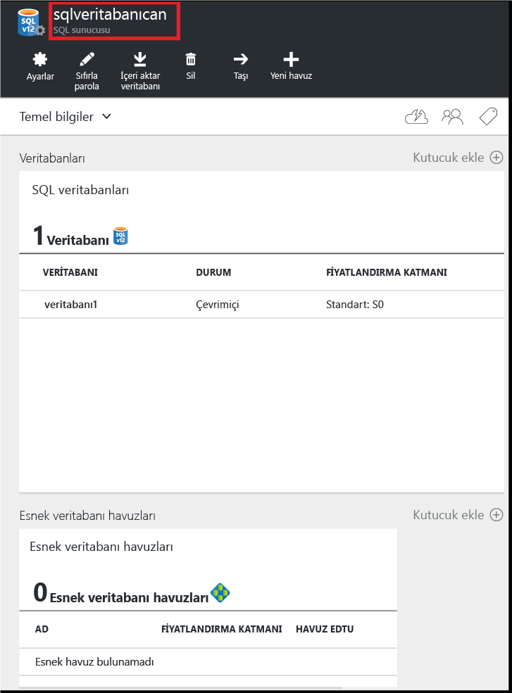
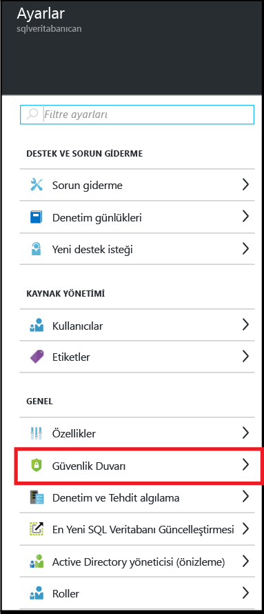
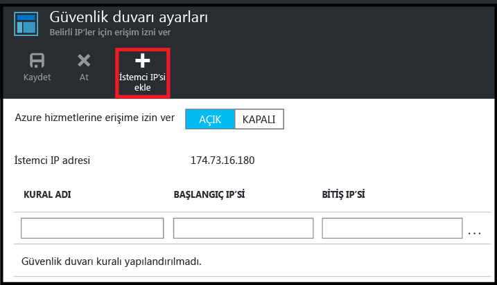
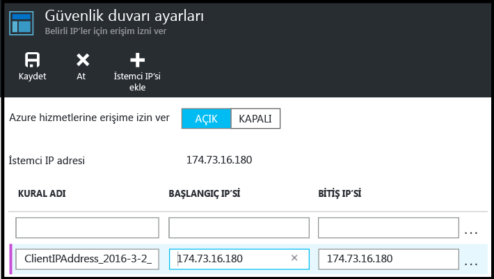

<!--
includes/sql-database-create-new-server-firewall-portal.md

Latest Freshness check:  2016-08-01 , rickbyh.

As of circa 2016-04-11, the following topics might include this include:
articles/sql-database/sql-database-get-started-tutorial.md
articles/sql-database/sql-database-configure-firewall-settings

-->
## Yeni bir Azure SQL sunucu düzeyinde güvenlik duvarı oluşturma

Tek bir IP adresinden (istemci bilgisayarınız) veya bir IP adresi aralığının tamamından SQL mantıksal sunucusuna bağlantılara izin veren sunucu düzeyinde güvenlik duvarı kuralı oluşturmak için Azure portalında aşağıdaki adımları kullanın. 

1. O anda bağlı değilse [Azure portal](http://portal.azure.com)’a bağlanın.
2. Varsayılan dikey pencerede **SQL Server**’a tıklayın.

    

2. SQL Server dikey penceresinde güvenlik duvarı kuralı oluşturulacak SQL sunucusuna tıklayın. 

    
           
3. Sunucunuz özelliklerini gözden geçirin.

    
      
4. Ayarlar dikey penceresinde **Güvenlik Duvarı**’na tıklayın.

    
    

    > [AZURE.NOTE] Sunucu düzeyi **Güvenlik duvarı ayarları** dikey penceresine Veritabanı dikey penceresi araç çubuğundan da erişebilirsiniz.

5. Azure’un, istemcinizin IP adresi için bir kural oluşturmasını sağlamak için **İstemci IP’si Ekle**’ye tıklayın.

      

6. İsteğe bağlı olarak, bir IP adresi aralığının erişmesine izin verecek güvenlik duvarı adresini düzenlemek için eklenen IP adresine tıklayın.

      
    
7. Sunucu düzeyinde güvenlik duvarı kuralı oluşturmak için **Kaydet**’e tıklayın.

     

    >[AZURE.IMPORTANT] İstemci IP adresiniz zaman zaman değişebilir; siz de yeni bir güvenlik duvarı kuralı oluşturana kadar sunucunuza erişemeyebilirsiniz. [Bing](http://www.bing.com/search?q=my%20ip%20address)’i kullanarak IP adresinizi denetleyebilir, sonra da tek bir IP adresi veya IP adresleri aralığı ekleyebilirsiniz. Ayrıntılar için bkz. [Güvenlik duvarı ayarlarını yönetme](sql-database-configure-firewall-settings.md#manage-existing-server-level-firewall-rules-through-the-azure-portal).

<!--HONumber=Aug16_HO1-->

