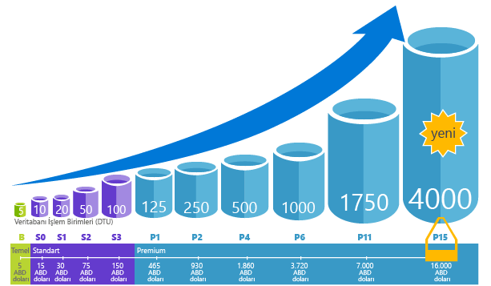

Veritabanı İşlem Birimi (DTU), gerçek dünya ölçümünü temel alan veritabanlarının görece gücünü temsil eden SQL Database'deki ölçü birimidir: veritabanı işlemi. Çevrimiçi işlem işleme (OLTP) isteği için bir dizi işlemi ele aldık ve ardından tam yüklü koşullarda saniyede kaç işlemin tamamlandığını ölçtük (bu kısa olan açıklamadır, dehşetli ayrıntıları [Karşılaştırmaya genel bakış](../articles/sql-database/sql-database-benchmark-overview.md) konusunda okuyabilirsiniz). 

Örneğin, 1750 DTU’ya sahip Premium P11 veritabanı 5 DTU’ya sahip Temel veritabanına göre 350 kat daha fazla DTU işlem gücü sağlıyor. 

> [!NOTE]
> Var olan bir SQL Sunucusu veritabanına geçiyorsanız, üçüncü taraf bir araç, [Azure SQL Database DTU hesaplayıcıyı](http://dtucalculator.azurewebsites.net/) kullanarak, Azure SQL Database’de veritabanına gerekebilecek performans düzeyini ve hizmet katmanını tahmin edebilirsiniz.
> 
> 

### DTU ve eDTU
Tek veritabanları için DTU esnek veritabanları için eDTU’ya doğrudan çevrilir. Örneğin, Temel esnek veritabanı havuzundaki bir veritabanı en çok 5 eDTU sunar. Bu, tek Temel veritabanıyla aynı performanstır. Farkıysa, esnek veritabanının gerekene kadar havuza ait eDTU’ları tüketmemesidir. 

Basit bir örnek yardımcı olur. 1000 DTU’ya sahip Temel esnek veritabanı havuzunu alın ve buna 800 veritabanını bırakın. Zaman içinde herhangi bir noktada (5 DTU 200 = 1000 X) 800 veritabanının yalnızca 200’ü kullanıldığı sürece havuzun kapasitesini yakalayamazsınız ve veritabanının performansı düşmez. Bu örnek net görülmesi için basitleştirilmiştir. Gerçek matematik biraz daha karmaşıktır. Portal matematik kısmını sizin için yapar ve geçmiş veritabanı kullanımına göre önerilerde bulunur. Önerilerin nasıl işlediğini anlamak veya matematik işini kendiniz yapmak için bkz. [Esnek veritabanı havuzuna dair fiyat ve performans hususları](../articles/sql-database/sql-database-elastic-pool-guidance.md). 

<!--HONumber=Jan17_HO3-->

