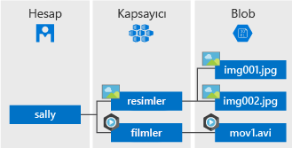

Azure Blob storage Microsoft'un nesne depolama için bulut çözümüdür. BLOB Depolama oldukça büyük miktardaki metin veya ikili veriler gibi yapılandırılmamış verileri depolamak için en iyi duruma getirilmiştir.

BLOB Depolama için idealdir:

* Görüntülerin veya belgelerin doğrudan bir tarayıcıya hizmet.
* Dağıtılan erişim için dosyaların depolanması.
* Video ve ses akışları.
* Günlük dosyalarına yazma.
* Yedekleme ve geri yükleme, olağanüstü durum kurtarma ve arşivleme için verilerin depolanması.
* Bir şirket içi tarafından analiz için verilerin depolanması veya Azure barındırılan hizmet.

Blob depolama alanındaki nesnelerin herhangi bir yere HTTP veya HTTPS aracılığıyla dünyanın erişilebilir. Kullanıcılar ya da istemci uygulamalar blobları URL'ler aracılığıyla erişebilir [Azure Storage REST API'sini](https://docs.microsoft.com/rest/api/storageservices/blob-service-rest-api), [Azure PowerShell](https://docs.microsoft.com/powershell/module/azure.storage), [Azure CLI](https://docs.microsoft.com/cli/azure/storage), veya bir Azure Storage istemci kitaplığı. Depolama istemcisi kitaplıklarını dahil olmak üzere birden çok dil için kullanılabilir olan [.NET](https://docs.microsoft.com/dotnet/api/overview/azure/storage/client), [Java](https://docs.microsoft.com/java/api/overview/azure/storage/client), [Node.js](http://azure.github.io/azure-storage-node), [Python](https://azure-storage.readthedocs.io/en/latest/index.html), [PHP](http://azure.github.io/azure-storage-php/), ve [Ruby](http://azure.github.io/azure-storage-ruby).

## Blob hizmeti kavramları

BLOB storage üç kaynakları gösterir: depolama hesabınız, hesaptaki kapsayıcılar ve bloblar bir kapsayıcıda. Aşağıdaki diyagramda, bu kaynakları arasındaki ilişkiyi gösterir.

### Depolama Hesabı

Azure Storage veri nesneleri tüm erişimi bir depolama hesabıyla yapılır. Daha fazla bilgi için bkz: [Azure storage hesapları hakkında](../articles/storage/common/storage-create-storage-account.md?toc=%2fazure%2fstorage%2fblobs%2ftoc.json).

### Kapsayıcı

Bir kapsayıcı, BLOB'ları, bir klasöre dosya sistemindeki benzer birtakım düzenler. Tüm bloblar bir kapsayıcıda yer alır. Bir depolama hesabı sınırsız sayıda kapsayıcı içerebilir ve bir kapsayıcıda sınırsız sayıda BLOB depolayabilirsiniz. Kapsayıcı adındaki harflerin küçük harf olması gerektiğini unutmayın.

### Blob
 
Azure Storage sunar üç türde BLOB--blok blobları, ekleme blobları ve [sayfa blobları](../articles/storage/blobs/storage-blob-pageblob-overview.md) (VHD dosyaları için kullanılan).

* Blok blobları, metin ve yaklaşık 4.7 TB kadar ikili veri depolayın. Blok blobları, ayrı ayrı yönetilen veri bloklarını yapılır.
* Ekleme blobları yapılma bloklarını blok blobları gibi çalışır, ancak için iyileştirilmiş ekleme işlemleri. Ekleme blobları sanal makinelerden verileri günlüğe kaydetmeye gibi senaryolar için idealdir.
* Sayfa BLOB deposu rasgele erişim boyutu 8 TB'ye kadar dosyaları. Sayfa bloblarını VM'ler geri VHD dosyalarını depolar.

Tüm bloblar bir kapsayıcıda yer alır. Bir kapsayıcı bir dosya sisteminde bir klasöre benzer. Daha fazla sanal dizinlere BLOB'lar düzenlemek ve bir dosya sistemi gibi bunları çapraz geçiş. 

Ağ kısıtlamalarının kablo üzerinden Blob depolamaya veri yükleme veya indirme yapmayı kullanışsız hale getirdiği çok büyük veri kümelerinde verileri doğrudan veri merkezinden içeri veya dışarı aktarmak için Microsoft’a sabit sürücüler gönderebilirsiniz. Daha fazla bilgi için bkz: [Blob depolama alanına veri aktarmak için Microsoft Azure içeri/dışarı aktarma hizmeti kullanma](../articles/storage/common/storage-import-export-service.md).
  
Kapsayıcıları ve blobları adlandırma hakkında ayrıntılı bilgi için bkz. [Kapsayıcıları, Blobları ve Meta Verileri Adlandırma ve Bunlara Başvurma](/rest/api/storageservices/Naming-and-Referencing-Containers--Blobs--and-Metadata).
