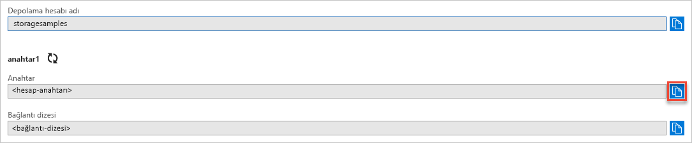

## Azure portalından kimlik bilgilerinizi kopyalama

Örnek uygulamanın, depolama hesabınıza erişim yetkisi vermesi gerekir. Bir bağlantı dizesi şeklinde uygulamaya depolama hesabı kimlik bilgilerinizi sağlayın. Depolama hesabınızın kimlik bilgilerini görüntülemek için:

1. [Azure portalına](https://portal.azure.com) gidin.
2. Depolama hesabınızı bulun.
3. Depolama hesabına genel bakışın **Ayarlar** bölümünde **Erişim anahtarları**’nı seçin. Hesap erişim anahtarlarınız ve bağlantı dizeniz görüntülenir.
4. Yetkilendirme için gerekecek olan depolama hesabınızın adını not edin.   
5. **key1** bölümünde **Anahtar** değerini bulun ve **Kopyala** düğmesine tıklayarak hesap anahtarını kopyalayın.

    
