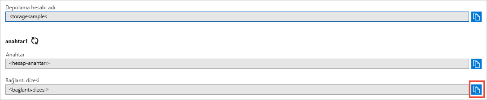

## Azure portalından kimlik bilgilerinizi kopyalama

Örnek uygulamanın, depolama hesabınıza erişim için kimlik doğrulaması gerçekleştirmesi gerekir. Kimlik doğrulaması gerçekleştirmek için, depolama hesabınızın kimlik bilgilerini uygulamaya bir bağlantı dizesi olarak ekleyin. Bu adımları izleyerek depolama hesabı kimlik bilgilerinizi görüntüleyin:

1. [Azure portalına](https://portal.azure.com) gidin.
2. Depolama hesabınızı bulun.
3. Depolama hesabına genel bakışın **Ayarlar** bölümünde **Erişim anahtarları**’nı seçin. Burada, hesap erişim anahtarlarınızı ve her anahtar için tam bağlantı dizesini görüntüleyebilirsiniz.   
4. **key1** bölümünde **Bağlantı dizesi** değerini bulun ve **Kopyala** düğmesini seçerek bağlantı dizesini kopyalayın. Sonraki adımda bir ortam değişkenine bağlantı dizesini ekleyeceksiniz.

    
