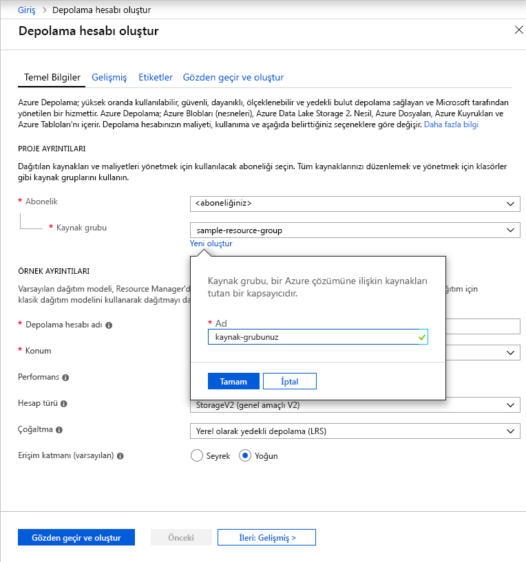

Azure portalında genel amaçlı v2 bir depolama hesabı oluşturmak için aşağıdaki adımları izleyin:

1. Azure portalda **Tüm hizmetler**’i seçin. Kaynak listesinde **Depolama Hesapları** yazın. Yazmaya başladığınızda liste, girişinize göre filtrelenir. **Depolama Hesapları**’nı seçin.
1. Açılan **Depolama Hesapları** penceresinde **Ekle**'yi seçin.
1. Depolama hesabının oluşturulacağı aboneliği seçin.
1. **Kaynak grubu** alanı altında **Yeni oluştur**’u seçin. Aşağıdaki görüntüde gösterildiği gibi yeni kaynak grubunuz için bir ad girin.

    

1. Ardından, depolama hesabınız için bir ad girin. Seçtiğiniz ad Azure genelinde benzersiz olmalıdır. Ad ayrıca 3 - 24 karakter uzunluğunda olmalıdır ve yalnızca rakam ve küçük harf içerebilir.
1. Depolama hesabınız için bir konum seçin veya varsayılan konumu kullanın.
1. Bu alanları varsayılan değerlerine ayarlanmış olarak bırakın:

   |Alan  |Değer  |
   |---------|---------|
   |Dağıtım modeli     |Resource Manager         |
   |Performans     |Standart         |
   |Hesap türü     |StorageV2 (genel amaçlı v2)         |
   |Çoğaltma     |Okuma erişimli coğrafi olarak yedekli depolama (RA-GRS)         |
   |Erişim katmanı     |Sık Erişimli         |

1. Depolama hesabı ayarlarınızı gözden geçirmek ve hesabı oluşturmak için **Gözden Geçir + Oluştur**’u seçin.
1. **Oluştur**’u seçin.

Depolama hesaplarının türleri ve diğer depolama hesabı ayarları hakkında daha fazla bilgi için bkz. [Azure depolama hesabına genel bakış](https://docs.microsoft.com/azure/storage/common/storage-account-overview). Kaynak grupları hakkında daha fazla bilgi için bkz. [Azure Resource Manager’a genel bakış](https://docs.microsoft.com/azure/azure-resource-manager/resource-group-overview). 
