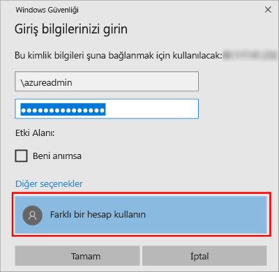

1. Azure sanal makinesi oluşturulup çalıştırıldıktan sonra VM'lerinizi görüntülemek için Azure portalında Sanal Makineler simgesine tıklayın.

1. Yeni VM’niz için üç noktaya **...** tıklayın.

1. **Bağlan**'a tıklayın.

   

1. VM’niz için tarayıcınızın indirdiği **RDP** dosyasını açın.

1. Uzak Masaüstü Bağlantısı, bu uzak bağlantının yayımcısının tanımlanamadığı bildiriminde bulunur. Devam etmek için **Bağlan**’a tıklayın.

1. **Windows Güvenliği** iletişim kutusunda, **Farklı bir hesap kullan**’a tıklayın. Bunu görmek için **Diğer seçenekler**’e tıklamanız gerekebilir. VM oluştururken yapılandırdığınız kullanıcı adını ve parolayı belirtin. Kullanıcı adından önce ters eğik çizgi eklemeniz gerekir.

   

1. Bağlanmak için **Tamam**’a tıklayın.
